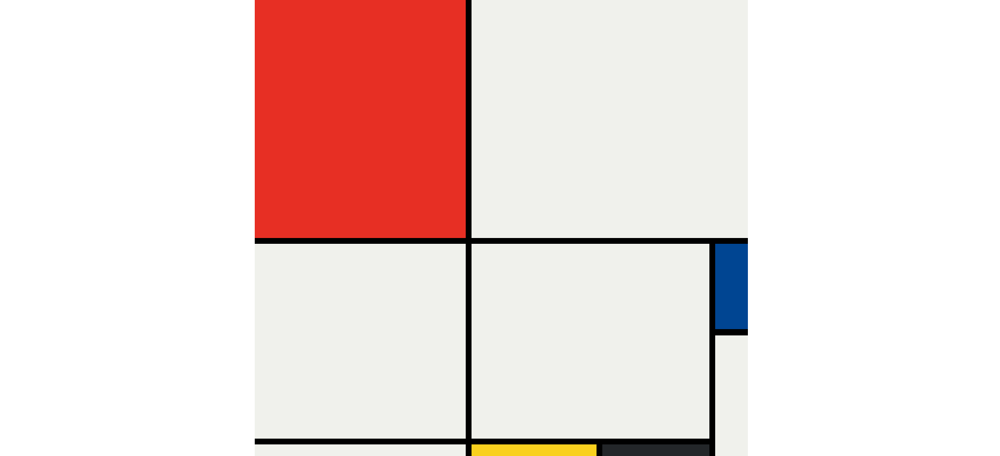

# My Mondrian painting project🎨
This is a recreation of a Mondrian-style painting built with CSS Grid.  
This was a project from Angela Yu’s Web Development Bootcamp.

## Preview

PS: This took me days, taught me that coding is art and an expression of the coder, and humbled me with gap vs borders🤣
